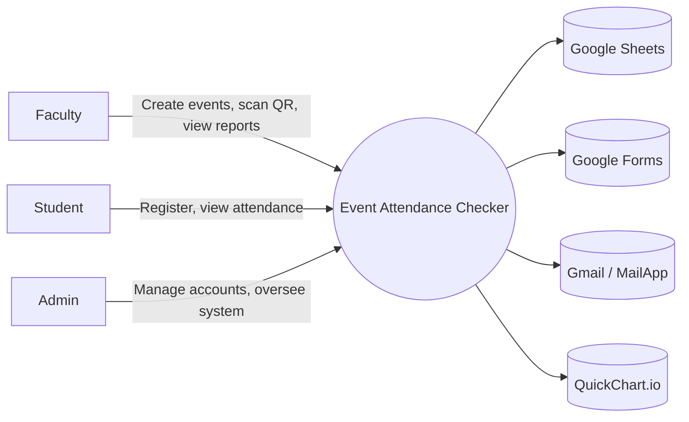
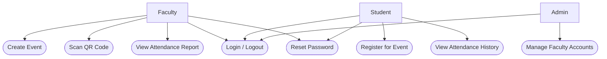
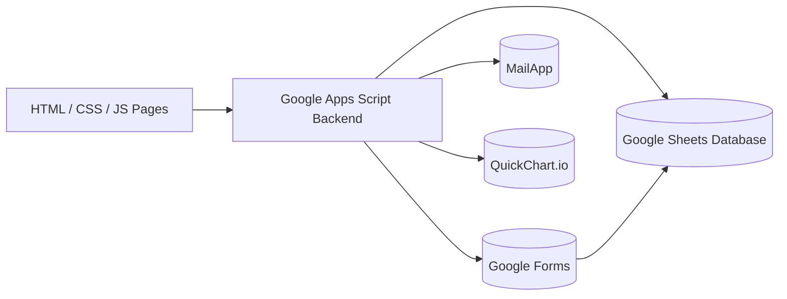
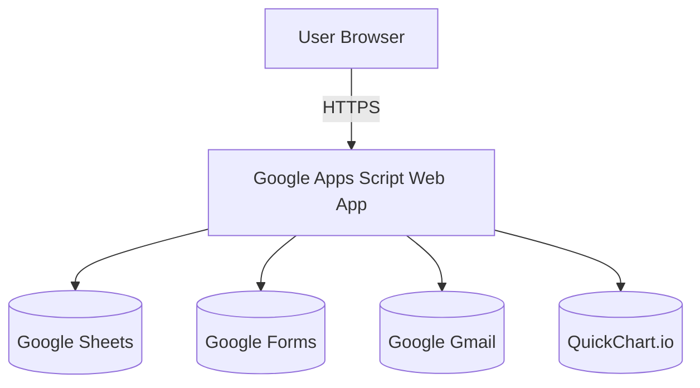
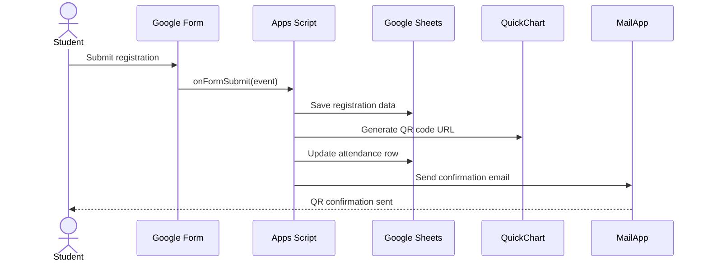

# EAC System - Complete System Flow Reference
# Event Attendance Checker - ASIATECH CEITE
# Stack: Google Apps Script + Google Sheets + HTML/CSS/JS

Last Updated: April 11, 2026

## Core Diagrams

### Context Diagram

### Use Case Diagram

### Component Diagram

### Deployment Diagram

### Sequence Diagram

## Architecture
- Frontend: Vanilla HTML/CSS/JS pages (Live Server or local file hosting during development)
- Backend: Google Apps Script Web App (`doGet(e)` + `doPost(e)`)
- Database: Google Sheets (`EAC_Database`)
- External services:
  - QuickChart.io (QR generation)
  - Google Forms (event registration)
  - Gmail `MailApp` (confirmation + OTP emails)
- Version control: GitHub

## Deployment URL
- `scriptURL = 'https://script.google.com/macros/s/AKfycbzYdDr94uC7aByOQG7l2DNXUuIVfUxmn5aHBdl5_ZHvCabQoz0wHNSAtTdnRPVwepRK4g/exec'`

## System Purpose
- Faculty creates events.
- System auto-creates Google Form registration per event.
- Students register via Google Form and receive confirmation email with unique QR.
- Faculty scans QR for check-in and checkout.
- Attendance status updates in Google Sheets.

## Roles
- Faculty
- Student
- Admin

Admin note:
- Faculty accounts are manually managed.
- Faculty self-registration is not implemented.

## Database Sheets

### Events Sheet
- A = Timestamp
- B = EventName
- C = Date
- D = Location
- E = Notes
- F = FormURL
- G = FacultyEmail
- H = FormID
- I = ResponseSheetName

### Faculty Sheet
- A = Email
- B = PasswordHash (salted SHA-256 output)
- C = Role
- D = Name

### Students Sheet
- A = Email
- B = PasswordHash (salted SHA-256 output)
- C = Role
- D = Name
- E = StudentID
- F = Course
- G = YearLevel
- H = Section

### Responses - EventName Sheet (one per event)
- A = Timestamp
- B = Email
- C = FullName
- D = StudentID
- E = Course
- F = YearLevel
- G = Section
- H = UniqueCode
- I = QRCodeURL
- J = AttendanceStatus
- K = CheckInTime
- L = CheckOutTime

Status flow:
- `REGISTERED` -> `PRESENT` -> `COMPLETED (OUT)`

### OTP Sheet
- A = Email
- B = OTPCode
- C = ExpiryTimestamp

Notes:
- Auto-created on first forgot-password request
- OTP rows are updated/replaced per user
- OTP row is deleted after successful reset or expiry

## API Surface

### `doGet(e)` - Read Operations
- `?action=getEvents`
- `?action=getMyEvents&faculty=EMAIL`
- `?action=getAttendance&event=NAME`
- `?action=getStudentAttendance&email=EMAIL`

### `doPost(e)` - Write/Sensitive Operations
Content type:
- `application/x-www-form-urlencoded`
- body format: `data=JSON.stringify({ action, ...params })`

Actions:
- `login` -> `{ email, password }`
- `register` -> `{ email, password, name, studentId, course, yearLevel, section }`
- `createEvent` -> `{ name, date, location, notes, faculty }`
- `scan` -> `{ code, event }`
- `deleteEvent` -> `{ name, faculty }`
- `changePassword` -> `{ email, currentPassword, newPassword, role }`
- `sendOTP` -> `{ email }`
- `verifyOTP` -> `{ email, otp, newPassword }`

## Backend Implementation Notes

### Event creation and registration
- `createEvent` is already migrated to `POST`.
- `postNewEvent(...)` creates Google Form, links destination to spreadsheet, and stores event metadata (including `FormID`).
- `onFormSubmit(e)`:
  - Generates unique code (`CEITE-XXXXXX`)
  - Generates QR URL via QuickChart
  - Writes `REGISTERED` status and attendance columns
  - Resolves event by `FormID`
  - Renames response tab to `Responses - EventName`
  - Saves response sheet name to Events col I
  - Sends QR email confirmation

### Scan flow
- `scanQrCode(uniqueCode, eventName)`:
  - 1st scan -> `PRESENT` + check-in time
  - 2nd scan -> `COMPLETED (OUT)` + check-out time
  - 3rd+ scan -> blocked (`ALREADY_SCANNED`)

### Delete event flow
- `deleteEvent(eventName, facultyEmail)`:
  - Normalized event + faculty ownership check
  - Response sheet resolution fallback:
    - saved name (col I)
    - standard `Responses - EventName`
    - formId-based lookup
    - loose normalized match
  - Unlinks form destination before delete
  - Deletes response sheet
  - Trashes form
  - Deletes event row last

### Authentication and password security
- Password verification now uses salted SHA-256 flow (not plain text comparison).
- Password storage uses hashed representation with per-user salt.
- Updated login/register/change-password/reset flows are aligned with hashed-password model.

### Forgot password (OTP)
- `sendOTP` now supports both Faculty and Students.
- `verifyOTPandReset` now supports both Faculty and Students.
- OTP is 6-digit with 5-minute expiry and single-use deletion.

## Core Helper Functions
- `sanitizeSheetName(name)`
- `_norm(v)`
- `findResponseSheetByFormId(ss, formId)`
- `getEventMetaByName(eventName)`
- `resolveResponseSheetByEventName(eventName)`

## Frontend Pages

### Faculty
- `faculty-dashboard.html`
- `faculty-create-event.html`
- `faculty-my-events.html`
- `faculty-scan-qr.html`
- `faculty-reports.html`
- `faculty-profile.html`
- `faculty-settings.html`

### Student
- `student-dashboard.html`
- `student-profile.html`
- `student-attendance.html`
- `student-settings.html`
- `student-register.html`

### Auth
- `loginpage.html`

## Current Frontend Behavior Notes

### Dashboards
- Faculty dashboard event table shows newest created events first (`events.slice().reverse()`).
- Student dashboard active events list also shows newest created first (`filter(...).reverse()`).

### Student attendance page
- Table layout includes:
  - Event name + optional note
  - Schedule
  - Location
  - Status badge
  - Check-in
  - Check-out
- Attendance data comes from `getStudentAttendance`.
- Event schedule/location/notes are merged from `getEvents`.

### Profile pages (faculty + student)
- Top greeting/date chips removed.
- Snapshot sections removed.
- Profile pages now focus on:
  - identity header
  - quick actions
  - stats cards
  - photo upload/remove
- Photo storage is local browser storage per account (`localStorage`), not cloud-stored.

## Session Management
- Login success stores session:
  - `sessionStorage.setItem('user', JSON.stringify(result))`
- Protected pages validate role from session and redirect if invalid.
- Logout:
  - `sessionStorage.removeItem('user')`
  - redirect to login page

## Security Rules
- Sensitive/mutating actions use POST.
- Read-only actions use GET.
- Institutional email enforcement: `@asiatech.edu.ph`.
- Password policy:
  - minimum 8 chars
  - uppercase
  - lowercase
  - number
  - special char
- OTP:
  - 6-digit
  - 5-minute validity
  - single-use delete

## Attendance Status Flow
- `REGISTERED` (after form submit)
- `PRESENT` (first scan)
- `COMPLETED (OUT)` (second scan)
- `ALREADY_SCANNED` (third scan+ blocked)

## Mobile Responsiveness
- Sidebar with hamburger + overlay
- Mobile slide-in nav
- Media queries for tablet/mobile breakpoints
- Scrollable data tables on smaller widths

## Known Limitations
- Profile photos are stored only in browser `localStorage` (device/browser-specific).
- Student dashboard announcements are static.
- Faculty self-registration is not implemented.
- If legacy plain-text passwords exist from older versions, they should be migrated to hashed format.

## Maintenance Rule
This file is the project source of truth for architecture and flow.

When system behavior changes:
- Update this file together with the code change.
- Keep endpoints, sheet schema, status flow, and page behavior aligned with implementation.
